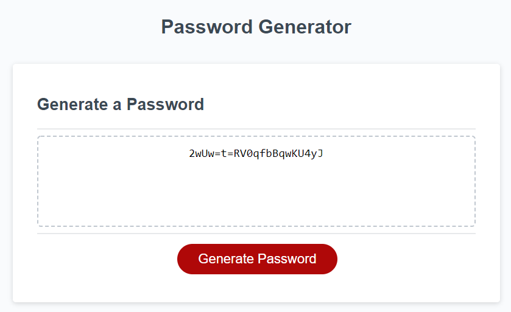

# Password Generator Using JavaScript

## Description
Create a functioning password generator using JavaScript that prompts the user for inputs. 

## Functionality
- Click on button and starts prompt functions
- First prompt asks for password length with a validity check
- Confirm boxes then pop up for type of characters used
- If no character types are selected, returns request to select at least 1 type
- Generates pasword with selected variables and outputs it to the screen

## Links
-[Github code link](https://github.com/heintze11/password-generator)

-[Github pages link](https://heintze11.github.io/password-generator/)

## Screenshot

